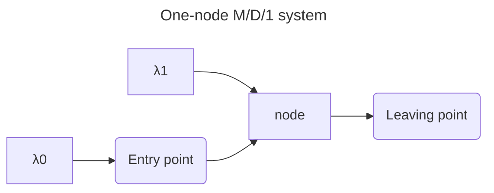
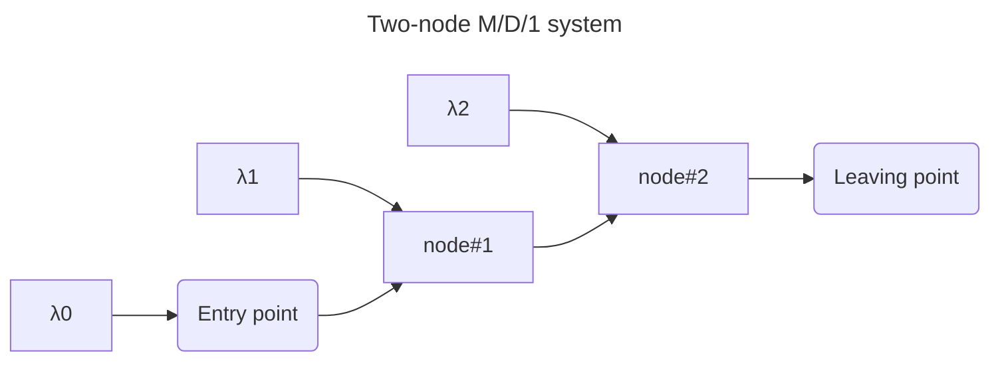

Simple queueing project

Get the repository and cd into the folder

```
git clone https://github.com/marco-create/queueing.git
cd queueing
```

Install requirements from the root directory

```
pip install -r requirements.txt
```
Now you can run it

```
mdone_one_node.py
```

or

```
mdone_two_node.py
```

<hr>





