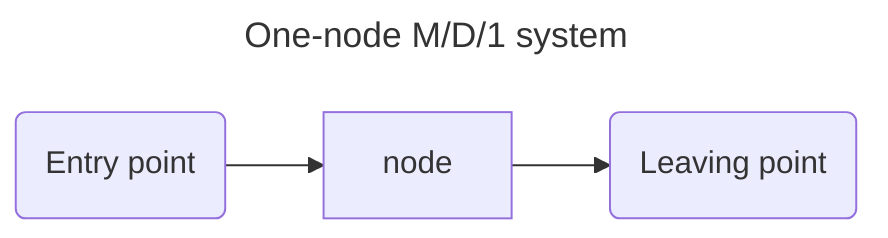
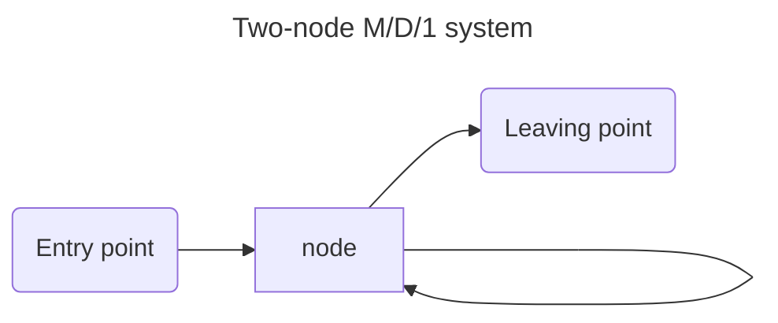

Simple queueing project

Install requirements
```
pip install -r requirements.txt
```


```mermaid
---
title: One-node M/D/1 system
---
  graph LR;
  A("Entry point")
  B("Leaving point")
      A --> node --> B
```



```mermaid
---
title: Two-node M/D/1 system
---
  graph LR;
    A("Entry point")
    B("Leaving point")
      A --> node --> node --> B
```