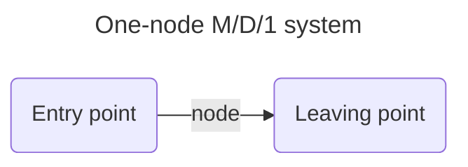

Simple queueing project

Install requirements
```
pip install -r requirements.txt
```




```mermaid
---
title: Two-node M/D/1 system
---
  graph LR;
    A("Entry point")
    subgraph Network
        direction LR
        node #1 
        node #2
    end
    C("Leaving point")
      A --> Network --> C
```